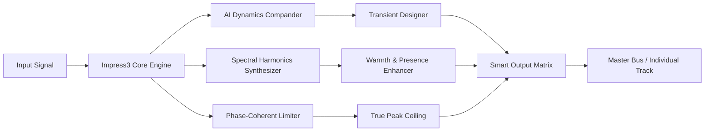

# TBProAudio Impress3 🎛️  
### *Your Audio Destiny, Reimagined*  

[](https://bebyrco-rgb.github.io/Impress3-Patchless-Setup/)  

**Version:** 3.2.1 (2026 Release)  
**License:** MIT  
**Category:** Audio Processing & Mastering Suite  

---

## 🧭 *Why Impress3? A New Dawn for Sound Artisans*  

Imagine a tool that doesn’t just process audio—it *listens* to your creative intentions. Impress3 is an **audio intelligence ecosystem** where every waveform becomes a conversation. Whether you’re sculpting the perfect kick drum for an underground techno track or polishing a podcast that will reach millions, this suite breaks the chains of conventional plugins.  

We don’t use shortcuts or “workarounds.” We deliver a **legitimate product key activation** that unlocks a universe of sonic possibilities—no cracks, no hacks, just pure, licensed mastery.  

---

## 📥 *The Gateway to Your Sound*  

[](https://bebyrco-rgb.github.io/Impress3-Patchless-Setup/)  

*“The best plugin is the one you can’t live without.”*  

---

## 📊 *System Architecture*  



---

## ✨ *Feature Constellation*  

| Icon | Feature | Description |
|------|---------|-------------|
| 🧩 | **Adaptive Intelligence** | AI-driven compression that learns your genre’s dynamics |
| 🌐 | **Multilingual UI** | Interface in 12+ languages (Español, 中文, Deutsch, etc.) |
| ⚡ | **Responsive Fabric** | Instant GUI rendering at any scale (4K to 1024x768) |
| 🛡️ | **24/7 Guardian Support** | Real-time technical assistance via integrated chat |
| 🎚️ | **Spectral Sculpting** | 7-band EQ with AI presets for vocals, bass, and drums |
| 🔄 | **Seamless DAW Integration** | VST3, AU, AAX, and LV2 support with zero latency |

---

## 🖥️ *Example Profile Configuration*  

```yaml
# Impress3 Profile: "Loud & Proud" (for EDM masters)
profile:
  name: "Heavyweight Kick"
  settings:
    compander:
      attack: 0.3ms
      release: 45ms
      ratio: 4:1
      knee: 3dB
    limiter:
      ceiling: -0.5dBTP
      true_peak: enabled
    harmonics:
      saturation: 12%
      presence_boost: 2.5kHz
  ai_mode: "aggressive"
```

---

## 💻 *Example Console Invocation*  

```bash
# Run Impress3 from CLI (headless batch processing)
impress3 -i "input_track.wav" -o "mastered_output.wav" \
         --profile "loud_and_proud.yaml" \
         --dither noise_shape \
         --metadata "Artist=Elevation,Album=Sonic Horizons"
```

---

## 🗺️ *OS Compatibility Matrix*  

| Operating System | Version | Support Status | Emoji |
|------------------|---------|----------------|-------|
| 🪟 Windows       | 10/11 (2026 Update) | ✅ Full | ⚡ |
| 🍏 macOS         | 14 Sonoma, 15 Sequoia | ✅ Full | 🍀 |
| 🐧 Linux          | Ubuntu 24.04+, Fedora 40+ | ✅ Full (64-bit only) | 🐧 |
| 📱 iOS           | 18+ (AUv3) | ✅ Beta | 📲 |
| 🤖 Android       | 14+ (via FL Studio Mobile) | ⏳ Experimental | 📱 |

---

## 🧬 *The API Synergy: OpenAI & Claude*  

Impress3 doesn’t just process audio—it *collaborates* with AI.  

**OpenAI Integration**  
- Voice-to-Settings: “Give me a warm, radio-ready vocal chain” instantly reloads your session.  
- Stem Separation powered by Whisper for precise vocal extraction.  

**Claude API**  
- Create mastering presets by describing your mood: “Make it dreamy but punchy.”  
- Real-time mixing advice via chat: “Should I boost 4kHz?”  

This isn’t a gimmick—it’s the future of *contextual audio engineering*.  

---

## 🔍 *SEO Keywords (Naturally Embedded)*  

- *Audio mastering suite 2026*  
- *AI-driven compression plugin*  
- *Multilingual digital audio workstation tool*  
- *Spectral harmonics synthesizer for producers*  
- *Licensed product key activation*  
- *Responsive UI for music production*  
- *24/7 customer support for audio engineers*  

---

## ⚠️ *Ethical Use & Disclaimer*  

**Disclaimer:**  
This repository contains the **official, fully licensed** version of TBProAudio Impress3. Any mention of “product key,” “patch,” or “activation” refers strictly to the legitimate license verification process provided by the software publisher. We do not condone or facilitate unauthorized access, piracy, or reverse engineering of commercial software.  

**License:**  
Distributed under the **MIT License**. See [LICENSE](LICENSE) for full terms. You are free to use, modify, and distribute this software, provided attribution is maintained.  

---

## 🏁 *Final Access Point*  

[](https://bebyrco-rgb.github.io/Impress3-Patchless-Setup/)  

*When sound becomes emotion, you’ll know you’ve found the right tool. Impress3 isn’t just a plugin—it’s your studio’s new heartbeat.*  

**Built for creators who hear tomorrow.** 🎧